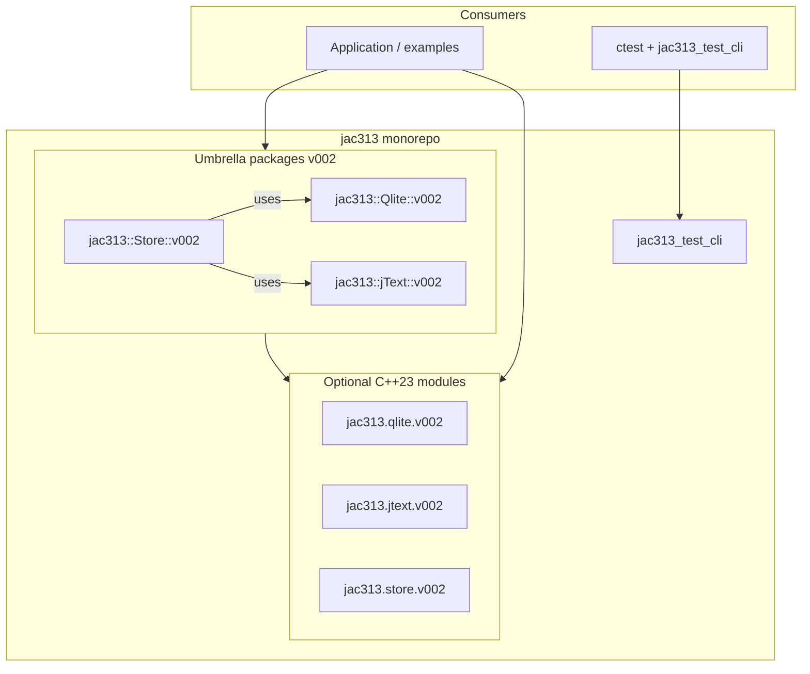
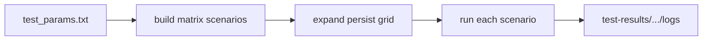

# Architecture and design

How jac313 is structured, why it's an umbrella, how the test pipeline works, and the
knobs for adapting it to a workload. The [main README](../README.md) is the overview;
this is the detail.

---

## Layout

```
jac313/
├── CMakeLists.txt            # build all or pick packages
├── Qlite/                    # SQLite wrapper umbrella  (jac313::Qlite::v002)
├── jText/                    # structured-text umbrella (jac313::jText::v002)
├── Store/                    # time-series logging store (jac313::Store::v002)
├── Setup/                    # toolchain sensing + provisioning (jac313::Setup)
├── tools/jac313_test_cli/    # local C++ test runner / matrix orchestrator (no shell scripts)
├── tests/                    # matrix params (smoke / full / bench)
├── test-summary/             # tracked results DB + rendered RUN.md pages
└── docs/                     # this documentation set
```

The legacy sibling repos (`jacQlite`, `jText`, `ts_store`) are no longer required to build —
their implementations now live in this repo. They remain only as historical origin.

---

## The umbrella model

jac313 is a **versioned umbrella** over a family of C++ libraries. The goal is not to rewrite
everything at once, but to give new code a stable, namespaced home while legacy implementations
keep working until they are migrated in place.

Every package lives under `jac313::<Name>::v002`. The `v002` suffix is a **contract, not a
comment**: it reserves room for a future `v002` without breaking callers who pin a version in
their includes or module imports. Legacy names (`jac::qlite`, `jText.h`,
`jac::ts_store::inline_v002`) keep working alongside the umbrellas.

Why an umbrella instead of a big-bang rename: the family grew as separate repos with their own
naming. A monolithic rename would have frozen development and broken every downstream include.
The umbrella lets us point new work at `jac313::*::v002` immediately, move implementation across
the fence one package at a time, and retire legacy repos when nothing references them — not on a
calendar. Store migration proved it: core headers, persistence sinks, binary reader, and the
matrix stress binaries now live under `Store/` without anyone abandoning the old tree overnight.

### Layers



| Layer | Role |
|-------|------|
| **Umbrella headers** | Public entry points (`include/jac313/.../v002.hpp`). |
| **C++23 modules** | Optional `import jac313.*.v002` path (Ninja module scanning). See [Modules.md](Modules.md). |
| **Store (in-tree)** | Owns the hot path + persistence sinks (binary, jText, SQL, flag-routing). Uses jText and Qlite. See [Store docs](store/). |
| **jac313_test_cli** | Local runner: configure/build, ctest discovery, matrix grids. No shell scripts. |

---

## Test pipeline



The functional matrix is a **pass/fail correctness gate** — it records no database. Throughput is a
separate pipeline: `store_bench --suite --db test-summary/bench_results.db` → `--report` →
`test-summary/*.md`.

1. **ctest** — one invocation per registered test; module smokes + a single path per matrix binary.
2. **Smoke matrix (116, functional)** — full persist × output-mode grid at minimal scale; used by `release-check`.
3. **Full matrix (116, functional)** — same grid with ts_store stress scaling; correctness under load.
4. **Multi-toolchain** — `release-check-all` runs the standard set per host: **gcc15 + clang**.

The matrix is the **functional/correctness** suite. Throughput is no longer read as "peak ops/sec"
from test logs — it now comes from a separate `store_bench --suite` (curated 10-config run, headline =
median + low–high band). See [Benchmarks.md](Benchmarks.md).

Throughput metrics are **DB-only** (`test-summary/bench_results.db`, tracked) — there are no file
side-channels; the markdown `Run_NNN.md` pages render from DB views via `store_bench --report`. See
[Benchmarks.md](Benchmarks.md) for commands and the per-run results layout.

### Testing without CI theatre

There is no GitHub Actions layer — deliberately. `jac313_test_cli` *is* the orchestrator: probe
compilers, configure, build, run ctest, execute the persist/scale matrix. Feedback stays local
and fast, and mirrors how ts_store was validated on real disks. The matrix is not "more
ctests" — it's the same binaries run many times with different persistence backends and CLI
scaling, closer to production than a single `add_test` line.

---

## Customization and performance

jac313 is a **broad starting point**, not a single tuned appliance. The defaults favor
portability, correctness, and clarity: **`CMAKE_BUILD_TYPE=Debug` by default**, full
verification in stress tests, multiple persist backends. `--release` is a first-class profile
(committed baselines include both Debug and Release, kept distinct by the `build_type` identity
dimension). Throughput leaderboards are intentionally not the default yet.

Production workloads — robotics positioning, orbital tracking, high-rate instrumentation — each
have different latency, retention, and durability needs. You adapt templates, persist mode, and
build profile to your domain.

| Optional knob | When it helps |
|------|----------------|
| **Release builds** | Production throughput; often 2×+ over Debug on the same hardware |
| **Direct slot indexing** | Known `(thread, event)` grids — less atomic contention than a global ID |
| **Pre-sized block files** | Fixed event counts — `mmap` once, write by slot instead of append growth |
| **Sharded persist channels** | Many-core writers — per-lane queues instead of one mutex + append cursor |
| **Verification tier** | Dev: full structural verify; prod: lighter or sampled checks |
| **`persist=none` hot path** | Maximum in-memory rate; attach binary/SQL/jText when durability matters |

The matrix gate validates the baseline; your box and your workload set the ceiling.

---

## Design principles

- **Small chunks** — thin re-export today, implementation migration tomorrow.
- **No breaking changes** — legacy entry points keep working until retired.
- **Versioned namespaces** — `::v002` is a contract, not a comment.
- **Monorepo, modular retirement** — one GitHub home; legacy repos fade individually.
- **Metrics in the DB, not side-channels** — one source of truth, identity-keyed, no drift.
- **No CI theatre** — the local runner is the orchestrator; feedback is fast and real.
